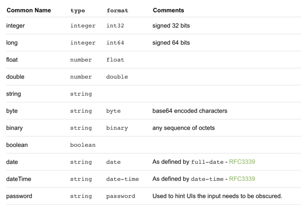

# 使用时间类型

## 需求

目前 Swagger 文档规范支持的数据类型如下：（v2.0版本规范）



其中并不包括对形如 `HH:mm:ss` 这种**纯时间**数据类型的支持。

因此 Leap 针对这种类型进行了扩展。

## 定义

按照 Swagger 以上定义，Leap 针对纯时间数据类型也给出了类似定义：

| Common Name | type | format | Comments |
| --- | --- | --- | --- |
| time | string | time | As defined by partial-time - [RFC3339](https://xml2rfc.tools.ietf.org/public/rfc/html/rfc3339.html#anchor14) |

## 使用

目前 Leap 支持映射到这种纯时间数据类型的 Java 类有两个：

- `java.sql.Time`;
- `java.time.LocalTime`。

使用这两个类型的对象返回到前端的值都将是形如 `HH:mm:ss` 格式的字符串。

而在自动生成的 swagger 文档中，类型也将是上面定义提到的类型。

例如接口中有一个字段 `birthTime`，文档中字段类型元数据将会是这样：

```json
birthTime: {
    type: "string",
    format: "time"
}
```

> 当使用 Swagger UI 解析文档时，这个类型将被认为是普通 string 类型，不影响正常解析。