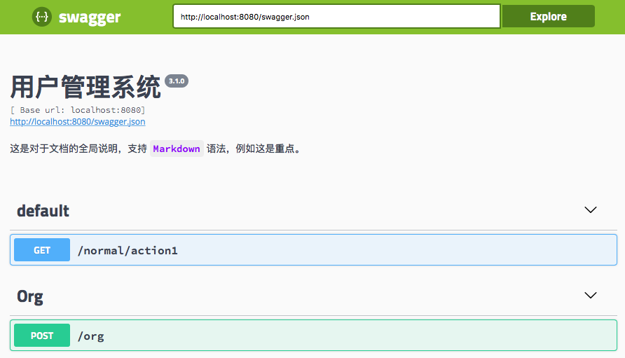

# 编写全局文档

前面章节在介绍如何编写和生成文档时，针对的都是具体某个接口的文档。

但是在实际项目中可能会有一些全局的业务规则、约定、说明或者是概念需要在文档中说明清楚，这个时候就需要编写全局的文档说明了。

## 在配置文件中编写

我们编辑之前配置的 API 配置文件 `conf/apis.xml`：

```xml
<?xml version="1.0" encoding="UTF-8"?>
<apis xmlns="http://www.leapframework.org/schema/webapi">
    <api name="api" base-path="/">
        <title>用户管理系统</title>
        <version>3.1.0</version>
        <desc>这是对于文档的全局说明，支持 `Markdown` 语法，例如这是**重点**。</desc>
    </api>
</apis>
```

对比之前介绍过的配置，我们在 `api` 元素下新增了三个元素：

- `title`：作为整篇文档的标题，对应 swagger 文档规范中的 `info.title` 元素；
- `version`：作为文档所对应应用接口的版本，对应 swagger 文档规范中的 `info.version` 元素；
- `desc`：全局文档的具体内容，根据 swagger 的规范，支持 Markdown 语法，对应 swagger 文档规范中的 `info.description` 元素。

配置完毕我们重新启动工程，使用 Swagger UI 渲染我们的文档，应该可以看到以下文档页面：



## 在 Markdown 文件中编写 desc

从上例中我们可以看到 `desc` 元素是支持 Markdown 语法的，而且在实际项目中，需要详细描述的全局文档内容一般都是很多的。

这个时候如果这些内容都写在 `apis.xml` 配置文件中显然不合适。

在前面注解引用文件那一节我们介绍了当接口说明比较长时，可以使用文档引用表达式引用某个 Markdown 文件内容作为接口说明。

同理在 desc 元素上也是支持这么干的。

我们把上例修改成引用文档的形式：

```xml
<?xml version="1.0" encoding="UTF-8"?>
<apis xmlns="http://www.leapframework.org/schema/webapi">
    <api name="api" base-path="/">
        <title>用户管理系统</title>
        <version>3.1.0</version>
        <desc>doc:desc.md</desc>
    </api>
</apis>
```

然后对应的，在 `doc` 目录下新建一个 `desc.md` 文件，文件内容如下：

```markdown
这是对于文档的全局说明，支持 `Markdown` 语法，例如这是**重点**。
```

这个时候重新启动工程，Swagger UI 渲染结果将与上例一致。