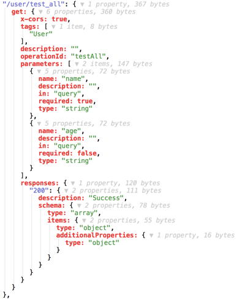

# 配置 SQL 接口

Restd 除了之前介绍的自动为实体生成基础增删改查接口的功能外，为了适应更广泛的开发需求，Restd 还支持基于 SQL 自动生成接口。

## 配置

### 配置 SQL

假设我们按照之前 SQL 配置章节介绍的那样在 `conf/sqls.xml` 文件中配置了这样一条 SQL ：

```xml
<?xml version="1.0" encoding="UTF-8"?>
<sqls xmlns="http://www.leapframework.org/schema/sqls">
    <command key="user.all">
        select * from User
        where name = #name#
        {? and age > #age# }
    </command>
</sqls>
```

### 配置 Restd

然后我们可以在 `conf/apis.xml` 文件中配置 Restd 根据这条 SQL 自动生成接口：

```xml
<?xml version="1.0" encoding="UTF-8"?>
<apis xmlns="http://www.leapframework.org/schema/webapi">
    <api name="api" base-path="/" restd-enabled="true">
        <restd>
            <model name="User">
                <sql-operation name="testAll" sql-key="user.all"/>
            </model>
        </restd>
    </api>
</apis>
```

### 生成效果

启动工程，我们可以在启动完成时控制台打印的路由表中看到自动生成的这个接口：

```
METHOD  PATH              ACTION                                                  DEFAULT VIEW
------  ---------------   -----------------------------------------------------   ------------------------------
...
GET     /user/test_all    SqlOperationProcessor$$Lambda$134/1322556641@60c5d682   (none)
...
```

另外自动生成的接口也会自动生成 swagger 文档。

我们访问应用的 `/swagger.json` 可以看到接口中增加了下面这条：



## 接口规则

在路由表中我们可以看到生成接口的 HTTP METHOD 类型是 GET，这是 Leap 解析 SQL 根据 SQL 语句的类型设置的。

SQL 语句类型对应 HTTP METHOD 规则如下：

- `select` 语句对应 `GET` ；
- `insert` 语句对应 `POST` ；
- `update` 语句对应 `PATCH` ；
- `delete` 语句对应 `DELETE` 。

再看路由表中的 PATH ，可以看到 `/user/test_all` 的组成是**实体名前缀加 sql-operation 的 name 属性**，且这个 name 属性**默认会进行小写下划线风格的转换**。

## 参数规则

对比生成的文档以及上面所写的 SQL ，我们可以发现 Leap 会自动帮我们处理接口支持的参数。

具体处理规则如下：

- SQL 中所有的**命名参数占位符**都会作为生成接口的接口参数；
- SQL 中普通的命名参数占位符在作为生成接口参数时是**必传**的；
- 在 SQL 动态语句中的命名参数占位符在作为生成接口参数时是**可选**的；
- 目前生成接口参数的类型只支持 `string` 类型。