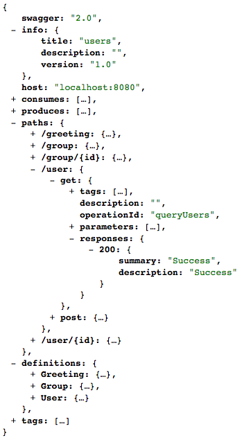

# 描述文件

在基于 SOAP 的 Web Service 中，每个服务都提供对应的 WSDL 文件用来描述该服务。

而在 RESTful API 中，也需要有一个对应的说明文件来描述该 API ，在 Leap 的 API 规范中，我们使用 [Swagger](http://swagger.io/specification/) 来作为描述语言。

举个例子，对于一个名为 `hello` 的 API ，假设根路径是：

    https://api.example.com/hello

在根路径下输入 `/swagger.json` ：

    https://api.example.com/hello/swagger.json
    
需要返回一个 JSON 格式的 swagger 文件：

> 上图是一个示例，具体 API 返回的内容有所不同。