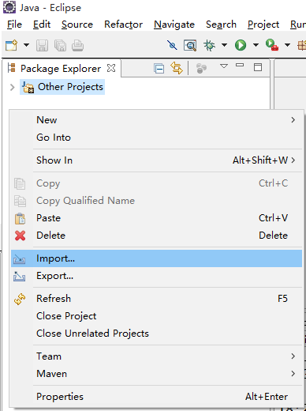
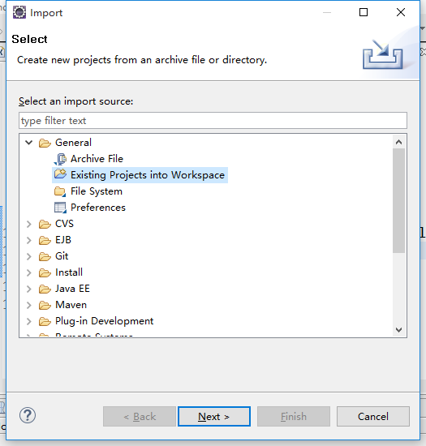
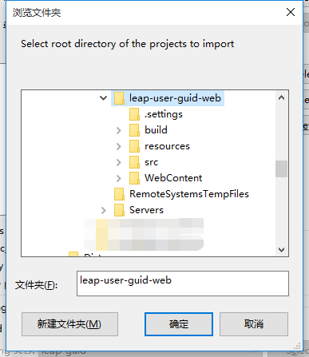
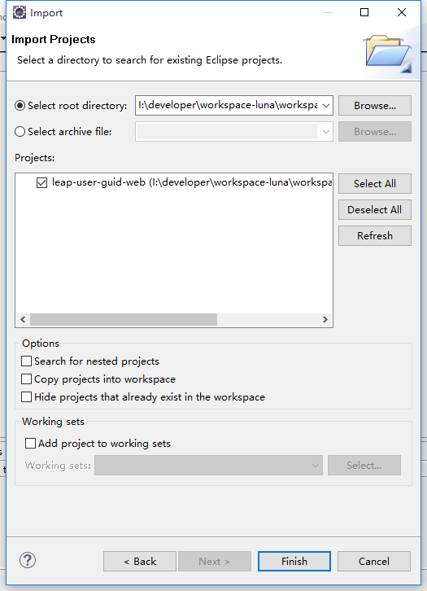
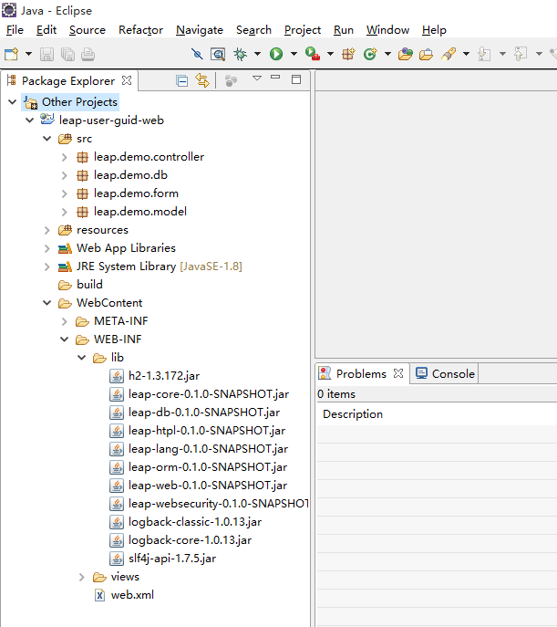
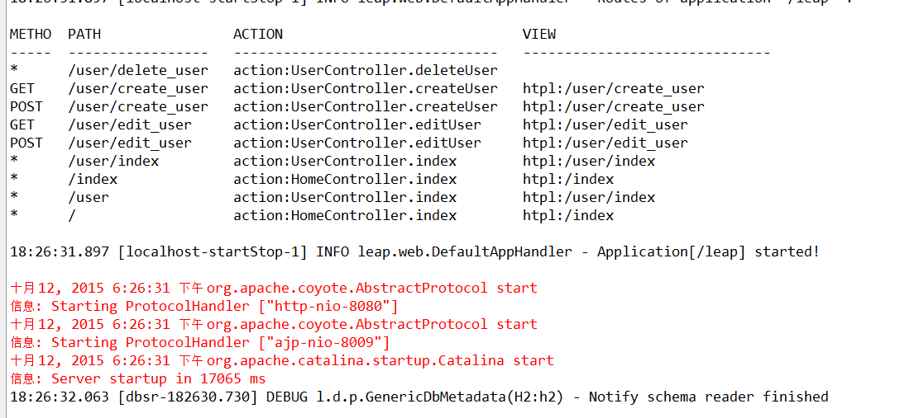
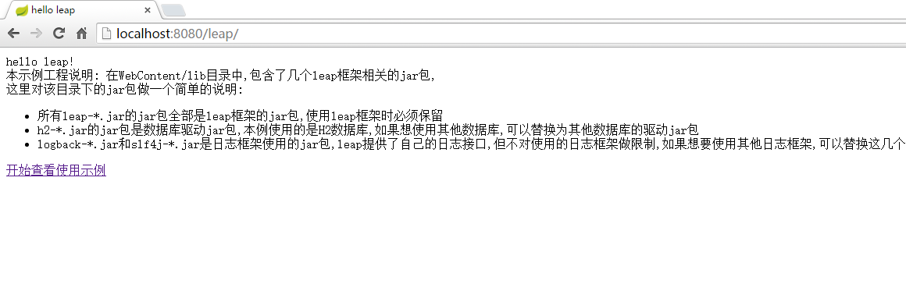

# 2.1 快速环境搭建

我们提供了基于eclipse的示例工程模板,请先下载示例工程[leap-user-guid-web](leap-user-guid-web.zip),如果你比较习惯使用**maven环境**进行开发的话,可以下载这个工程[leap-user-guid-maven](leap-user-guid-maven.zip).  
下载示例工程之后,将工程解压到你自己的目录,这里以web工程为例说明,maven工程是类似的.  
web工程解压之后,目录结构如下图:  
  
将工程导入到eclipse的工作空间中:  
先打开eclipse,在左边的package Explorer标签下右键打开菜单,选择`Import...`选项  
  
选择`Existing Projects into Workspace`打开选择工程的对话框  
  
点击`Browser...`按钮找到刚刚解压的目录,点击确定  
  
点击`finish`按钮将工程导入工作空间  
  
此时可以看到工程结构的目录如下图所示:  
  
将工程部署到tomcat(或其他web容器中),并运行,启动完成之后,可以看到在终端打印了日志:  
  
这个日志就是本示例工程的路由表,是leap框架特有的提供方便调试的功能,当然也可以作为应用启动完成的标识.
此时访问`http://localhost:8080/leap`可以看到如下页面:
  
说明本示例工程环境已经搭建完成,此时可以点击开始查看使用示例查看示例工程内置的一个简单的用户增删改查的功能,下一节将对这个示例工程进行详细说明.

[示例工程介绍](introduce.md)