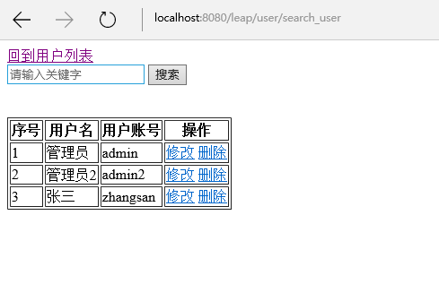

# 自定义第一个action
在前面我们已经了解leap框架的基础用法了,现在让我们自己动手尝试开发一个功能吧.我们尝试开发的功能就是用户搜索功能,要求在搜索框输入关键字之后,可以模糊匹配到用户名字和用户登录账号.
我们先在`UserController`内定义action:
```java
public void searchUser(ViewData vd, String key){
	key = Strings.trim(key);
	List<User> users = User.<User>where("name like ? or loginId like ?", 
			"%"+key+"%","%"+key+"%").list();
	vd.put("users", users);
	vd.put("key", key);
}
```
这里的`ViewData`是leap提供的视图数据模型,设置在`ViewData`实例的数据可以在视图中使用.
我们已经知道,按照leap框架的规则,这个action的访问地址是`http://localhost:8080/leap/user/search_user`,因此对应的视图是`WEB-INF/views/user/search_user.html`,我们在`WEB-INF/views/user/`目录下创建该文件`search_user.html`,这个文件是一个htpl模板,代码如下:  
```html
<!DOCTYPE html>
<html>
<head>
<meta charset="UTF-8">
<title>user search</title>
</head>
<body>
	<a href="/user">回到用户列表</a>
	<form action="/user/search_user" method="post">
	<input type="text" placeholder="请输入关键字" value="${key}" name="key"/>
	<button type="submit">搜索</button>
	</form>
	<br/>
	<br/>
	<table border="1">
		<thead>
			<tr>
				<th>序号</th>
				<th>用户名</th>
				<th>用户账号</th>
				<th>操作</th>
			</tr>
		</thead>
		<tbody>
		<!-- #for(user : users) -->
		<tr>
			<td>${loop.index}</td>
			<td>${user.name}</td>
			<td>${user.loginId}</td>
			<td>
				<a href="edit_user?loginId=${user.loginId}">修改</a>
				<a href="delete_user?loginId=${user.loginId}">删除</a>
			</td>
		</tr>
		<!-- #endfor -->
		</tbody>
	</table>
</body>
</html>
```
代码非常简单,与index.html的代码基本相同,只是增加了搜索输入框而已.  
接下来我们运行tomcat,访问如下路径`http://localhost:8080/leap/user/search_user`:  
  
输入相应的关键词即可搜索得到对应的记录了.