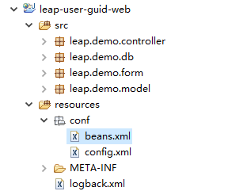
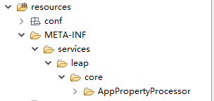
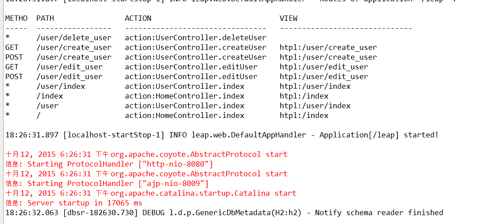

# 2.2 示例工程说明
上一节我们已经搭建好了示例工程的环境,这一节我们将对工程目录做一些简单的介绍以便大家后续进行开发的练习.
这里我们先看工程的文件结构:  
  
src目录下是java的包,需要注意的是resources/conf这个目录,这个目录下放的是leap的入口配置文件,包含了两个配置文件,分别是`beans.xml`和`config.xml`两个配置文件.  
继续看resource/META-INF文件夹下的结构,这里有一个特殊的目录结构:  
  
这个结构有一个特定的标准,在后边的章节会详细解释.  
最后是WebContent目录  
  
WebContent是标准的web应用的结构,有一点比较特殊的是在WEB-INF目录下有一个叫做`views`的文件夹,这个文件夹用来存放整个web应用的视图文件,这个结构是leap web应用的标准结构.
另外我们注意到在WebContent目录下还有一个static文件夹,这个文件夹用于存放应用的静态文件,按照J2EE的标准,静态文件在WebContent下的任意目录都是可以的,但是leap对static做了特殊的处理,我们建议,所有静态文件都放在static目录下,至于在这个目录下做了什么特殊的处理,将在HTPL模块的章节中详细介绍.

* 2.1.1 配置文件  

在resources目录下的config.xml便是leap框架的入口配置,config.xml的配置如下图所示:  
  ```xml
  <config xmlns="http://www.leapframework.org/schema/config">
  	<base-package>leap.demo</base-package>
  	<properties>
  		<property name="h2.driverClassName">org.h2.Driver</property>
          <property name="h2.jdbcUrl">jdbc:h2:classpath:/resources/h2db</property>
          <property name="h2.username">test</property>
          <property name="h2.password">test</property>
  	</properties>
  </config>
  ```
  这里的配置于其他常见的框架没有太多区别,因此不需要花太多时间去学习leap框架本身的配置规则,值得注意的是,在这里有一个`<base-package>leap.demo</base-package>`的配置,这个配置是leap框架扫描包的根目录,即所有需要leap框架自动处理的类都必须在这个包或者其子包内.这里其他的几项`properties`配置是数据库相关的属性配置,不难理解.  
  这里需要特别注意的:  
  **`config.xml`配置文件作为入口配置,是必须存在的,并且所在目录必须是源文件的根目录下的`conf`文件夹内,不可在其他位置(也不能在conf的子目录内)**  
  当然,leap允许创建多份配置文档,可以在`conf`文件夹下创建子文件`config`,所有放在`config`文件夹下的xml文件都会按照`config.xml`的格式加载.  

  我们继续看`beans.xml`的配置文件:  
  ```xml
  <beans xmlns="http://www.leapframework.org/schema/beans" default-lazy-init="true">
      <bean name="h2" type="javax.sql.DataSource" class="leap.core.ds.UnPooledDataSource" primary="true">
          <property name="driverClassName" value="${h2.driverClassName}" />
          <property name="jdbcUrl"         value="${h2.jdbcUrl}" />
          <property name="username"        value="${h2.username}" />
          <property name="password"        value="${h2.password}" />
      </bean>
  </beans>
  ```
  这里我们可以看到,对`bean`的配置没有太多特殊的地方,与大多数框架习惯性的配置方式一致,这也是leap的一个目标,尽量符合绝大多数开发人员的习惯,最大限度的减少学习成本.  
注意到这里的属性值采用了如`${h2.driverClassName}`的配置,这个配置的值我们可以在config.xml中看到,相信大家不难理解这里的含义.  
需要说明的是:  
**beans.xml并不是必须的,另外,beans.xml也和config.xml类似,运行在`conf`目录下创建子目录`beans`,在`beans`目录下的所有xml文件将按照beans.xml相同的格式加载.**

* 2.1.2 源代码  
  
这里我们以`leap.demo.controller.UserController`为例说明leap的源代码.
先看 [快速环境搭建](construction.md) 中看过的路由表:  
  
首先我们看到`UserController`继承了`ControllerBase`这个类,需要说明的是,这并不是必须的,`ControllerBase`是leap框架提供的控制器基类,里边包含了许多方便的方法供开发者使用,当然开发者如果不需要,也可以不继承这个基类.在`UserController`类上,既没有注解,也没有任何地方配置了这个控制器,那么leap是如何识别这个`UserController`是一个控制器的呢?前面我们已经提过了,在`config.xml`中有一个`<base-package>`的配置,其实leap在扫描`base-package`的包下的所有类时,会将所有类名为`*Controller`的类全部识别为控制器,这是leap的默认控制器协议,因此使用leap框架约定,所有的控制器命名都以Controller作为后缀,遵循约定大于配置的规则,可以极大的减少配置量.  
在路由表中我们可以看到,`UserController`下的访问路径都是/user/*,其中倒数第二行和倒数第四行两个路由规则处理的action是同一个函数`UserController.index`.这个函数是控制器的入口,当用户访问`{appcontext}/controller`和`{appcontext}/controller/index`这两个目录时,实际上leap都会调这个`controller`内的`index`函数进行处理.  
接下来看路由表的第一行,我们可以看到当浏览器请求`/user/deleted_user`时会调用`UserController.deleteUser`这个函数,从这里我们可以看到,函数名由驼峰式转化为下划线式就是该函数的访问路径了.  
在这里我们可以简单总结一下leap对mvc的处理默认规则.
  * 控制器都在`base-package`包或其子包下
  * 控制器不需要配置路由,leap框架自动将类名的controller后缀去掉之后,由驼峰式命名转化为下划线式命名即作为controller的访问路径
  * 对于单个单词(全小写),leap框架默认该单词即为访问路径
  * 在控制器下的方法也不需要配置访问路径,访问路径的转换规则和controller一致.

* 2.1.3 视图文件  

leap框架包含了自己的模板引擎,我们称为htpl模板引擎,htpl是一个高效的,基于html注释的无冗余元素和属性的模板引擎,在后边会有专门的章节介绍htpl模板引擎.这里我们先关注视图层的代码结构.  
可以看到,所有的视图源文件都在`WebContent/WEB-INF/views/`目录下,这里有一个`index.html`即为我们的应用欢迎页面.值得注意的是,leap默认使用`HomeController`类作为应用根目录的控制器,也就是说,当我们访问`{appcontext}/`的时候,会调用`HomeController.index`方法进行处理,并且返回这个`index.html`视图.  
leap的视图访问规则是按照url的访问路径来确定的,并且以`WebContent/WEB-INF/views/`作为根目录.比如在路由表中我们可以看到,当使用HTTP GET方法访问`{appcontext}/user/create_user`的时候,会调用`UserController.createUser`方法,并且返回的视图是`/user/create_user`.这个视图实际上就是`WebContent/WEB-INF/views/user/create_user.html`,
也即是到views目录相当于应用根目录,访问路径相对于应用根路径的位置即是改访问路径对应的视图位置.  
打开`WebContent/WEB-INF/views/user/index.html`文件,可以看到如下代码:  
  ```html
  <table border="1">
    <thead>
      <tr>
        <th>序号</th>
        <th>用户名</th>
        <th>用户账号</th>
        <th>用户密码</th>
        <th>操作</th>
      </tr>
    </thead>
    <tbody>
      <!-- #for(user : users) -->
      <tr>
        <td>${loop.index}</td>
        <td>${user.name}</td>
        <td>${user.loginId}</td>
        <td>${user.password}</td>
        <td>
          <a href="edit_user?loginId=${user.loginId}">修改</a>
          <a href="delete_user?loginId=${user.loginId}">删除</a>
        </td>
      </tr>
      <!-- #endfor -->
    </tbody>
  </table>
  ```
  可以看到,这里对用户的列表使用了#for指令循环打印了用户信息,使用#endfor指令表示循环结束.关于htpl的指令语法和java极为相似,不难理解,这里细心的用户可能已经注意到`${loop.index}`这个代码了,这里`loop`对象是htpl循环中提供的特殊对象,保存了当前循环的信息,比如这里用的`loop.index`就是表示当前循环的下标.

* 2.1.4 leap-orm  

接下来我们看一下,controller接收到请求之后,如何与数据库交互.  
打开`UserController`类,看到`public void editUser(ViewData vd, UserForm userForm)`函数,代码如下:
  ```java
  @POST
	public void editUser(ViewData vd, UserForm userForm){
		if(vd.validation().hasErrors() || vd.validation().validate(userForm).hasErrors()){
			return;
		}
		User user = User.find(userForm.loginId);
		user.setName(userForm.name);
		user.setPassword(userForm.password);
		try {
			user.update();
			response().sendRedirect("/user/index");
		} catch (Exception e) {
			vd.validation().addError("保存失败", e.getMessage());
		}
	}
  ```
  UserForm是一个参数接收类,这里是为了方便校验,使用了leap提供的参数校验功能,这里不是我们要关注的重点,有兴趣的话可以看一下UserForm这个类,这里我们主要看的是`User user = User.find(userForm.longinId)`这一行,还有`user.update()`这一句代码,这里我们发现,作为模型类的`User`,可以直接跟数据库交互,这个也是leap提供的ActiveModel模式的orm模块的主要特点.  
  打开`User`类:
  ```java
  @Table("leap_user")
  public class User extends Model {
  	@Column(name="user_name")
  	private String name;
  	private String loginId;
  	@Column(name="password")
  	private String password;
  	public String getName() {
  		return name;
  	}
  	public void setName(String name) {
  		this.name = name;
  	}
  	public String getLoginId() {
  		return loginId;
  	}
  	public void setLoginId(String loginId) {
  		this.loginId = loginId;
  	}
  	public String getPassword() {
  		return password;
  	}
  	public void setPassword(String password) {
  		this.password = password;
  	}
  }
  ```
  这个类上的注解很好理解,`@Table`表示这个模型类映射的数据库表,`@Column`表示指定的字段映射到数据库的字段,需要特别说明的是,`@Column`不是必须的注解,没有使用这个注解的字段,默认也会与数据库字段映射,并且遵循驼峰式转换为下划线式的转换规则,即`驼峰式(java)  ->  下划线式(数据库字段)`  
  `Model`类是leap-orm提供的基类,所有与数据库表有映射关系的模型类都要继承这个类以获得与数据库交互的能力.当然leap-orm也支持使用习惯的dao方式与数据库交互,在后续会有专门的章节说明.
* 2.1.5 leap工程的入口  

前面我们已经明白leap的工程是如何进行工作的了,现在我们来看看当web容器接收到请求之后,leap是如何接管请求处理的,打开`web.xml`可以看到如下配置:
```xml
<filter>
	<filter-name>app-filter</filter-name>
	<filter-class>leap.web.AppFilter</filter-class>
</filter>
<filter-mapping>
	<filter-name>app-filter</filter-name>
	<url-pattern>/*</url-pattern>
</filter-mapping>
```
这个配置就是leap的入口拦截器,这里拦截的路径用通配符表示全部拦截,因此所有的请求都将从这里被leap的拦截器拦截之后交由leap进行处理,当然,对于某些leap在控制路由表中找不到对应的action的请求,leap就会重新将请求交回给web容器,进入下一个拦截器或者servlet处理.

至此,我们对示例工程和使用leap开发的基本工程结构都有了一定的了解了.可以继续下一章节,开始创建我们自己的action了. 
  
  [自定义第一个action](first_action.md)