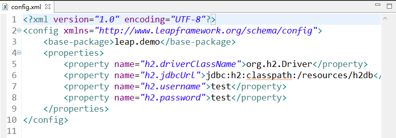
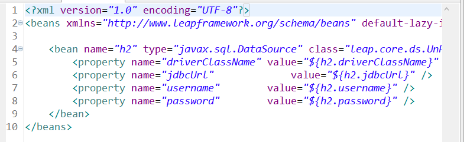

# 2.2 示例工程说明
上一节我们已经搭建好了示例工程的环境,这一节我们将对工程目录做一些简单的介绍以便大家后续进行开发的练习.
这里我们先看工程的源文件结构:  
  
src目录下是java的包,需要注意的是resources/conf这个目录,这个目录下放的是leap的入口配置文件,包含了两个配置文件,分别是`beans.xml`和`config.xml`两个配置文件,其中config.xml便是leap框架的入口配置,config.xml的配置如下图所示:  
  
这里的配置于其他常见的框架没有太多区别,因此不需要花太多时间去学习leap框架本身的配置规则,值得注意的是,在这里有一个`<base-package>leap.demo</base-package>`的配置,这个配置是leap框架扫描包的根目录,即所有需要leap框架自动处理的类都必须在这个包或者其子包内.这里其他的几项`properties`配置是数据库相关的属性配置,不难理解.  
这里需要特别注意的:  
**`config.xml`配置文件作为入口配置,是必须存在的,并且所在目录必须是源文件的根目录下的`conf`文件夹内,不可在其他位置(也不能在conf的子目录内)**  
当然,leap允许创建多份配置文档,可以在`conf`文件夹下创建子文件`config`,所有放在`config`文件夹下的xml文件都会按照`config.xml`的格式加载.  

我们继续看`beans.xml`的配置文件:  
  
这里我们可以看到,对`bean`的配置没有太多特殊的地方,与大多数框架习惯性的配置方式一致,这也是leap的一个目标,尽量符合绝大多数开发人员的习惯,最大限度的减少学习成本.  
注意到这里的属性值采用了如`${h2.driverClassName}`的配置,这个配置的值我们可以在config.xml中看到,相信大家不难理解这里的含义.  
需要说明的是:  
**beans.xml并不是必须的,另外,beans.xml也和config.xml类似,运行在`conf`目录下创建子目录`beans`,在`beans`目录下的所有xml文件将按照beans.xml相同的格式加载.**
