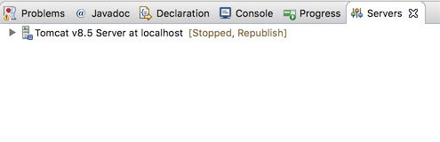
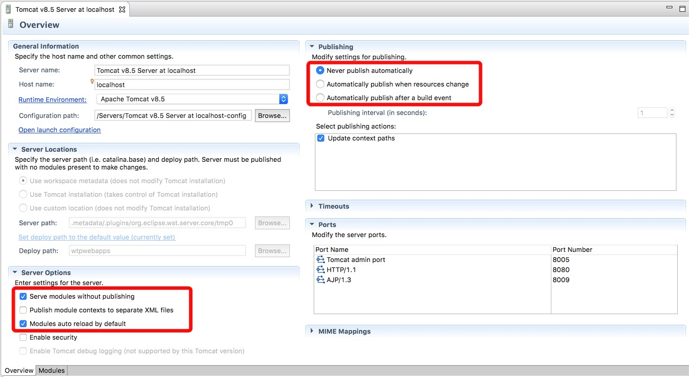
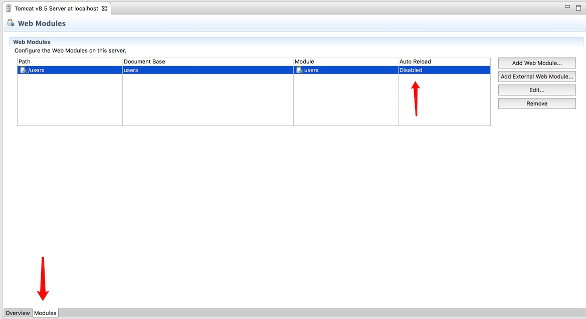
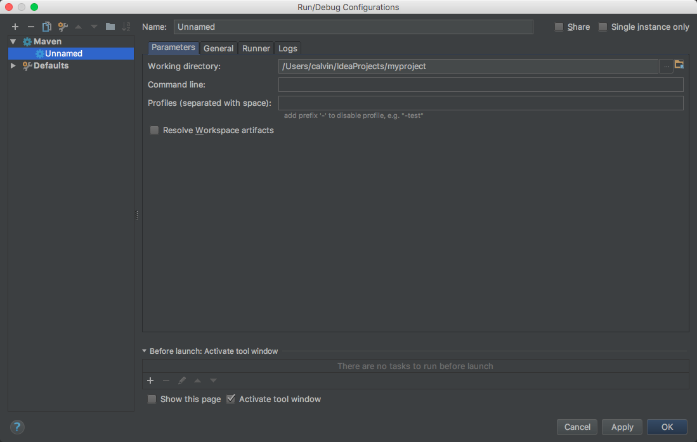

# SQL 配置重载

## 自动重载

Leap 在工程启动时会读取资源根目录下的 `/conf/sqls.xml` 文件以及 `/conf/sqls` 目录下所有的 XML 文件作为 SQL 配置文件。

但是我们在开发调试的过程中有时候需要频繁地对 SQL 配置文件进行修改、删除、新建等等。

如果每次都要重新启动工程让 Leap 重新去加载配置的话，会极大地影响开发效率。

因此 Leap 对这个问题提供了解决方案：**在工程启动的同时，启动监控线程去监控上面提到的 SQL 配置文件。**

监控线程是默认自动启动的，不需要做额外配置。

## 重载策略

监控线程启动之后，当我们在工程运行过程中更新了 SQL 配置文件，Leap 的重载策略有以下几种：

- 检测到**新增**的 SQL 配置文件，则加载进工程里，对于 `key` 属性重复的 `<command>` 直接覆盖；

- 检测到**更新**的 SQL 配置文件，也是加载进工程里，对于 `key` 属性重复的 `<command>` 直接覆盖；

- 检测到已有的 SQL 配置文件被**删除**，不执行任何动作。

## 适用范围

这在前面也有提到，Leap 提供这个功能的目的是为了提供开发效率，因此这个功能推荐**只在开发过程中使用**。

从上面的重载策略也可以看到，Leap 对于动态加载进来的重复 `key` 的 SQL 都是采用**直接覆盖**的方式方便开发调试。

如果在正式环境上使用这个功能去直接替换 SQL 配置，将会有可能导致重复 `key` 的 SQL 等到下次服务器重启时才报错。

因此这一点需要开发人员注意，正式环境任何更新都需要重启服务器。

## IDE 支持

由于不同的 IDE 部署 Web 服务器都有自己不同的策略，这有可能导致我们在工程中更新了 SQL 配置文件无法实时更新到工程部署路径下。

针对这一点，我们主要研究了当前比较流行的两款 IDE ，**Eclipse** 和 **Intellij IDEA** ，下面是针对这两款 IDE 进行设置使自动重载功能生效的具体步骤。

### Eclipse 设置

使用 Eclipse 开发 Web 应用我们一般都会在 Servers 窗口中新建服务器实例，如下图是我们建好的服务器：



双击服务器打开详细设置界面：



界面的左下角注意勾选上 `Serve modules without publishing` 。

> 因为在默认不勾选的情况下，Eclispe 会将工程部署到插件下的某个目录中，这样你在工程中做的改动在工程启动后都不会同步到部署目录中去。
> 当勾选上这个选项后，Eclispe 将会把工程的 target 目录作为部署目录，这个时候由于 Eclipse 的自动编译机制，它就会把工程中的改动实时编译到部署目录中。

然后我们需要在右边把热部署功能给关闭掉，不然每次更新配置文件都会造成 Tomcat 的热部署而重新启动工程。

然后切换到详细设置界面下面的 Modules 标签页，把对应应用的 `Auto Reload` 设置为 `Disabled` 。



### Intellij IDEA 设置

由于在 Intellij IDEA 的 Tomcat Server 运行配置中没能找到配置去更改工程的部署目录，因此暂时没法提供基于 Tomcat Server 运行配置的解决方案。

> 运行配置中有两项是关于重新加载类和资源文件的，但是经测试之后发现只能重新加载类，资源文件的更新还是没有反应。

不过我们可以借助 maven 插件 jetty 来做到这一点，因为 jetty 启动的默认部署目录就是 target 目录。

而且在 IDEA 中配置 jetty 启动工程也支持断点调试等功能，并不会影响到 IDEA 的各种开发支持。

首先我们需要在项目的 pom.xml 文件中配置工程支持 jetty 启动。

我们添加如下插件依赖：

```xml
<build>
    <plugins>
        <plugin>
            <groupId>org.eclipse.jetty</groupId>
            <artifactId>jetty-maven-plugin</artifactId>
            <version>9.4.5.v20170502</version>
        </plugin>
    </plugins>
</build>
```

然后在 IDEA 主界面点击菜单栏上的 `Run`，在下拉菜单中选择 `Edit Configurations...`，此时会弹出一个新窗口。

点击窗口左上角的加号 `+` ，在下拉列表中选择 maven，即创建一个新的 maven 运行配置。此时界面如下：



我们填写界面上的以下配置：

- Name：给这个运行配置起个名字，方便以后运行和调试，我们这里就叫 `jetty run` 吧。

- Working directory：设置命令的作用目录，一般默认当前项目根目录即可。

- Command line：填写 `clean:clean jetty:run`，这里先清理目录，然后指定使用 jetty 运行我们的项目。

- Resolve Workspace artifacts：勾选。当项目结构为多模块工程时这里必须勾选上。

点击确定之后就配置完成了。

现在我们可以在主界面右上角看见我们刚刚创建的运行配置，如下图：


以后在开发过程中我们就可以直接在这里点击运行或调试运行。

以这种方式运行的工程的部署目录是在工程的 target 目录下，但是由于 IDEA 不像 Eclipase 会自动编译，因此**对工程做了改动需要手动点击 `Build Project`** 才会更新到部署目录。