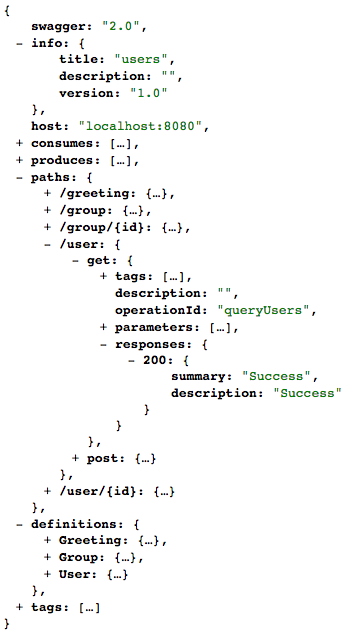
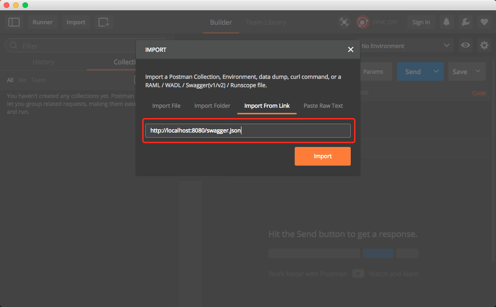
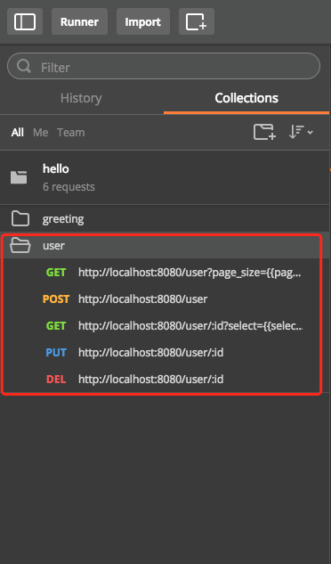

# 运行测试

## 运行

在命令行启动 Jetty Web Server ：

```
**[terminal]
mvn jetty:run
```

浏览器访问 `http://localhost:8080/user` ，将会返回空的 JSON 数组：

```json
[]
```

同时，Leap 为每个 API 都产生一个符合 [Swagger](http://swagger.io/specification/) 规范的描述文件，在 API 的根路径下拼上 `swagger.json` 即可访问：

[http://localhost:8080/swagger.json](http://localhost:8080/swagger.json)

返回类似下面图片的内容：



> `swagger.json` 文件的具体内容请参考 [Swagger](http://swagger.io/specification/) 规范。

## 测试

### 使用命令行

如果使用的是 *nix 系统，可以通过命令 `curl` 测试 API 。

发起创建用户请求：

```
**[terminal]
curl -X POST -d '{"name":"User1"}' -H "Content-Type: application/json" http://localhost:8080/user
```

成功后将返回：
  
```json
{"id":"i6wm@hoKf","name":"User1"}
```

> 其中 `id` 属性是随机生成的，每次测试的结果都会不同

再次打开浏览器访问 `http://localhost:8080/user` ，将会看到刚才创建的数据：

```json
[{"id":"i6wm@hoKf","name":"User1"}]
```

再测试下更新用户，使用获取到创建用户成功后返回的 `id` 作为参数，输入下面的命令：

```
**[terminal]
curl -X PUT -d '{"name":"User2"}' -H "Content-Type: application/json" http://localhost:8080/user/i6wm@hoKf
```

成功后无返回内容，再次浏览器访问 `http://localhost:8080/user` 可以看到新的内容：

```json
[{"id":"i6wm@hoKf","name":"User2"}]
```

可以看到用户的 `name` 属性的值由 `User1` 变成了 `User2` 。

### 使用 Postman

[Postman](https://www.getpostman.com/) 是一个 RESTful API 测试工具，支持导入 Swagger 的描述文档，可以非常方便的测试我们开发的 API 。

**导入 API 描述文档：**



导入后在左侧可以看到所有的 API 操作，点击具体操作就可以开始测试：



具体的测试过程在这里不详细描述，请根据 Postman 提供的资料自行了解。