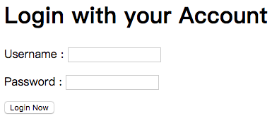

# 本地开发调试

上一章节介绍了如何配置工程接入授权服务器，这一章节介绍在开发阶段如何与授权服务器对接进行开发调试。

Leap 提供了一个用于调试的授权服务器 `debug-auth-server` ，可以安装在本地环境进行接入测试。

## 安装授权服务器

**可以选择下面两种方式之一进行安装：**

1. [下载](https://github.com/leap-guides/gs-oauth2/archive/master.zip)源码工程，或者通过git进行clone：

    ```
    **[terminal]
    git clone https://github.com/leap-guides/gs-oauth2.git
    ```
    
    进入 `gs-oauth2/debug-server` 目录，启动：
    
    ```
    **[terminal]
    mvn -Djetty.port=8088 jetty:run
    ```

2. 通过 Docker 启动：

    ```
    **[terminal]
    docker run -p 8088:8080 leapframework/debug-auth-server
    ```

安装完成并启动后，授权服务器地址为 `http://localhost:8088` 。

为了方便调试，授权服务器内置了 3 个用户和 3 个 `client` ：

* User：

username  | password
-------- | --------
user1        | pass1
user2       | pass2
user3       | pass3

* Client:

client_id    | client_secret
-------- | --------
client1       | secret1
client2      | secret2
client3      | secret3

## 验证测试

把配置文件中的 `oauth2` 参数改为下面的配置：

```xml
    <properties prefix="oauth2">
        <property name="enabled"        value="true"/>
        <property name="server_url"     value="http://localhost:8088"/>
        <property name="client_id"      value="client1"/>
        <property name="client_secret"  value="secret1"/>
    </properties>
```

访问地址 `http://localhost:8080/user` ，返回认证失败的 JSON 内容：

```json
{"code":"UNAUTHORIZED","message":"Unauthorized"}
```

接下来介绍如何使用 `debug-auth-server` 进行调试。

### 获取访问令牌

**1. 通过命令行方式获取令牌：**

```
**[terminal]
curl -X POST http://localhost:8088/oauth2/token\?grant_type\=password\&username\=user1\&password\=pass1\&client_id\=client1\&client_secret\=secret1    
```

在返回的JSON中可以找到 `access_token` ：
    
```json
{"access_token":"0e7c9bb3-72f1-421f-83d4-de561df8c3fe","token_type":"bearer","expires_in":3600,"refresh_token":"3faf8389-ab21-4b43-b45d-8f2cbf60cc8a"}
```

**2. 或者通过浏览器方式获取令牌：**

打开浏览器，访问下面的地址：

```    
http://localhost:8088/oauth2/authorize?response_type=token&client_id=client1&client_secret=secret1&redirect_uri=/show_access_token
```

输入用户名 `user1` 和密码 `pass1` 登录：
        

            
登录成功后将会显示 `access_token` ：
       
```
access_token: 0e7c9bb3-72f1-421f-83d4-de561df8c3fe
```

> 正式环境的授权服务器不提供这种方式。
        
### 通过访问令牌访问接口

浏览器打开地址：

```
http://localhost:8080/user?access_token=0e7c9bb3-72f1-421f-83d4-de561df8c3fe
```
    
> 需要把上面的 `access_token` 改为真实返回的内容

这次将会成功返回。